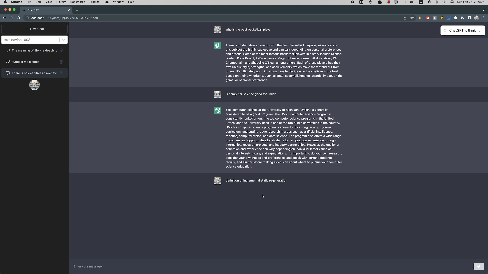

# ChatGPT-Clone
This is a clone to the ChatGPT interface using **Next.js 13** with **Tailwind CSS**
```bash
npx create-next-app -e with-tailwindcss ProjName
cd ProjName
```

## Getting started
```bash
git clone https://github.com/MelvinLecoy/ChatGPT-Clone.git
cd ChatGPT-Clone
npm install
...
npm run dev
```

## Tech stack involved
- Frontend: **Next.js 13**(**React**), **Typescript**, **Tailwind CSS**
- Backend: **Firebase**(**Firestore**, **Admin**), **OpenAI API**
- Miscellaneous: **NextAuth.js**(**Firebase Authentication**), **SWR**
- Subtle Libraries: react-select, react-hot-toast, @heroicons/react
- Deploy/Hosting: Vercel, Hostinger

## Final product

Above is a snapshot of the running website.
[Demo Video](https://youtu.be/TUeHDwlccqc)
